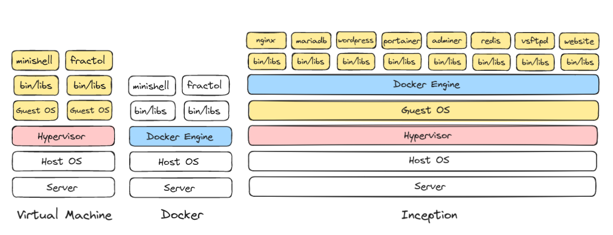
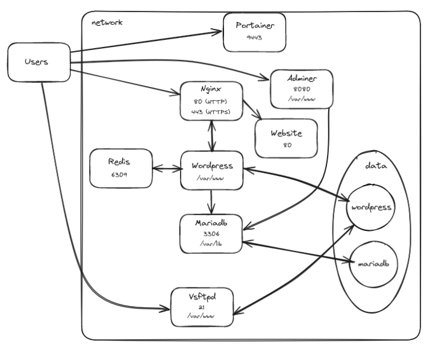
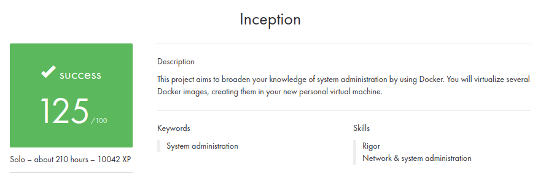

# Inception

### 💡 About the project

This project aims to broaden your knowledge of system administration by using Docker. You will virtualize several Docker images, creating them in your new personal virtual machine.

### Docker schem



### Network diagram



### 🛠️ Usage

In a linux Ubuntu based Virtual Machine put your user in sudo group ```usermod -aG sudo <your_username>```

Copy base files to folder of choice

Run setup using the provided Makefile: ```make setup```. Machine will reboot after that!

Run project using the provided Makefile: ```make```

### 📋 Results


