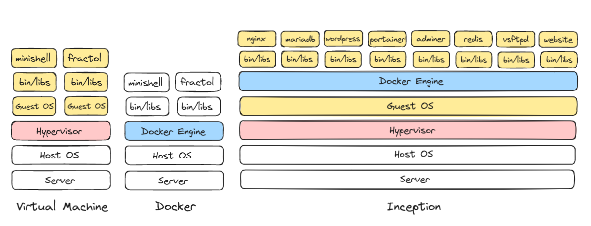
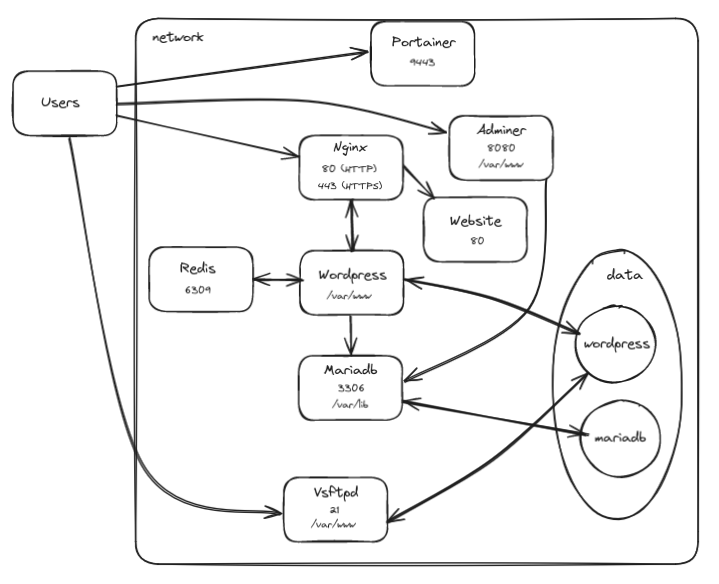

# Inception

## 💡 About the project

This project focuses on system administration and Docker containerization.

The goal is to virtualize several Docker images, creating a personal virtual machine with multiple services running in isolated containers.

## 📌 Docker schem



## 🌐 Network diagram



## 🛠️ Usage

### Run the project inside an Ubuntu-based Linux Virtual Machine.
### Add your user to the sudo group:
```bash
usermod -aG sudo <your_username>
```
### Copy the project base files to your desired folder.
### Run initial setup (the machine will reboot after this step):
```bash
make setup
```
### After reboot, run the project:
```bash
make
```

## 🌐 Access

After running the project, you can access the services through the following URLs and ports (assuming access from the VM or localhost):

| **Service**  | **URL/Port**           | **Description**                 |
|--------------|------------------------|--------------------------------|
| **WordPress**| https://localhost:443  | Main website (SSL enabled via nginx) |
| **Website**  | http://localhost:80    | Static website container        |
| **Adminer**  | http://localhost:8080  | Database management tool        |
| **Redis**    | Port 6379              | Redis cache service (CLI or apps) |
| **MariaDB**  | Port 3306              | Database server (for direct DB access) |
| **VSFTPD**   | Port 21                | FTP server                     |
| **Portainer**| https://localhost:9443 | Docker management UI           |
